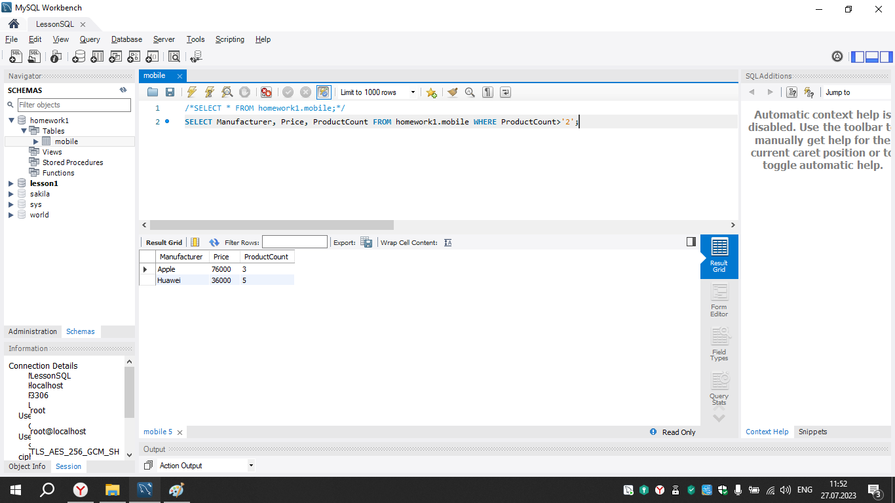

# Инструкция для работы с Markdown

## Выделение текста

Чтобы выделить текст курсивом, необходимо обрамить его звездочками (*) или знаком нижнего подчеркивния(_). Например: *вот так* или _вот так_.

Чтобы выделить текст полужирным, необходимо обрамить его двойнными звездочками (**) или двойнным знаком нижнего подчеркивния(__). Например: **вот так** или __вот так__.

Альтернативные способы выделения текста жирным или курсивом нужны для того, чтобы мы могли совмещать оба этих способа. Например, _текст может быть выделен курсивом и при этом быть **полужирным**_.

## Списки

Чтобы добавить ненумерованные списки, необходимо пункты выделить звездочкой (*).
Например: 
* Элемент 1
* Элемент 2
* Элемент 3

Чтобы добавить нумерованные списки, необходимо пункты просто пронумеровать.
Например: 
* ЭПервый пункт
* Второй пункт

## Работа с изображениями

Чтобы вствить изображение в текст, необходимо набрать следующее:

## ССылки

## Работа с таблицами

## Цитаты

## Заключение